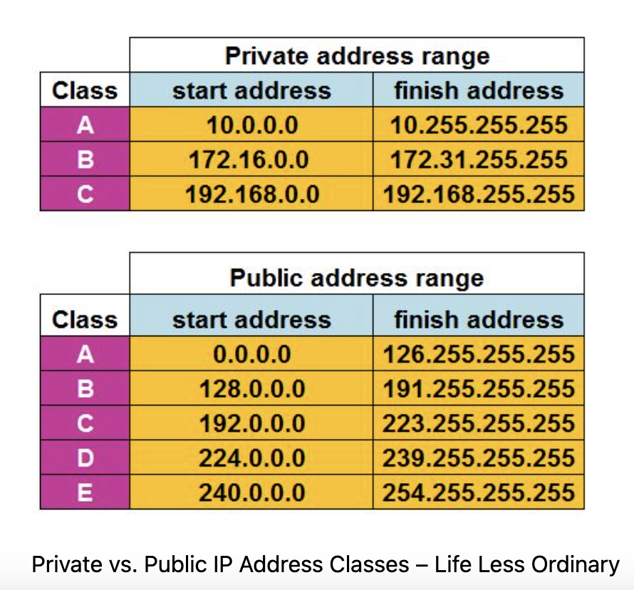
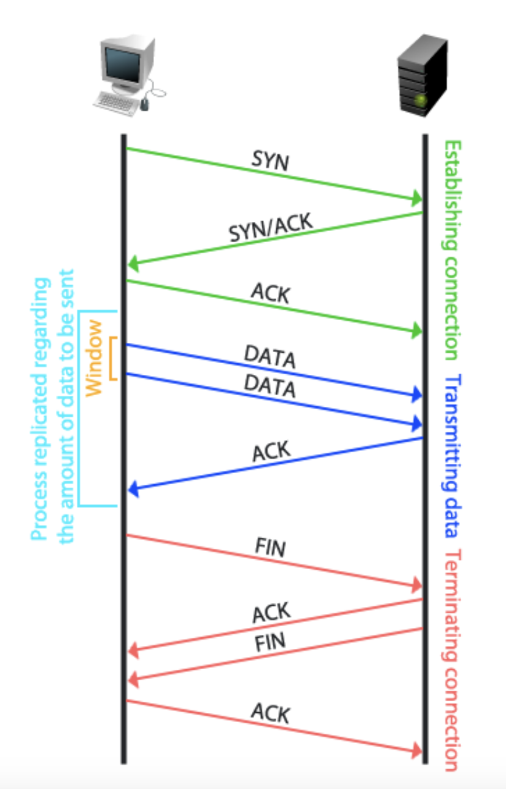
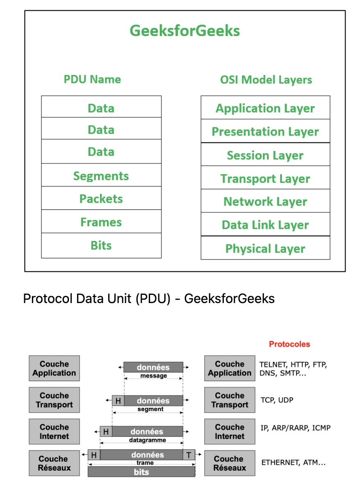
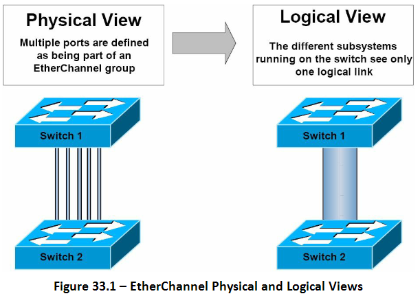
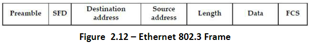
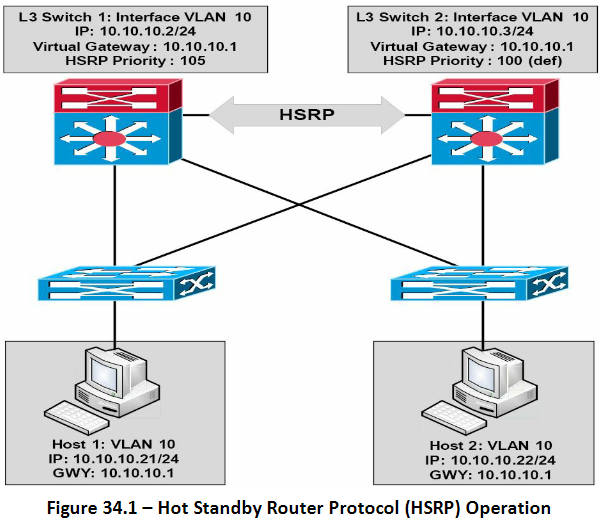
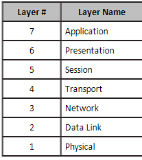
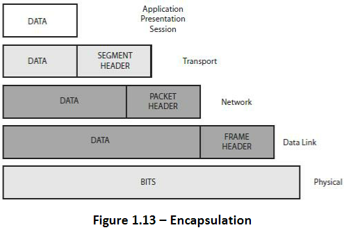

## The Address Resolution Protocol

* La logique du routage IP requière que les hosts et routers encapsulent les packets IP à l'intérieur de trames de couche data-link. Pour les interfaces Ethernet, comment un routeur connait quelle addresse MAC utiliser pour la destination ? Il utilise ARP.

* Dans les LANs Ethernet, à chaque fois q'un host ou un router à besoin d'encapsuler un Packet IP dans une nouvelle trame Ethernet, l'host ou le router connaît soit l'addresse IP du prochain device, soit l'addresse IP d'un autre host ou l'addresse IP par défaut du router. Un router connaît la route IP utilisée pour transférer le packet IP, qui liste l'addresse IP du prochain router. Néanmoins, les hosts et routers ne connaissent pas au préalable les addresses MAC des périphériques voisins. 

TCP/IP définit l'ARP comme la méthode par laquelle n'importe quel host ou router dans un LAN peut dynamiquement découvrir l'addresse MAC d'un autre IP host ou router dans le même LAN. ARP définit un protocol qui inclut l'**ARP Request**, un message qui fait la simple requête "Si c'est ton addresse IP, stp répond avec ton addresse MAC". ARP définit aussi le message **ARP Reply**, qui énumère à la fois l'addresse IP originale et l'addresse MAC correspondante. 

La figure suivante montre l' ARP Request envoyée par le router R3 (à gauche, comme un broadcast LAN). Tous les devices sur le LAN vont ensuite traiter la trame reçue. A droite, à l'étape 2, l'host PC2 renvoie une ARP Reply, identifiant l'addresse MAC de PC2. 
Le texte à côté de chaque messages montre le contenu à l'interieur du message ARP, qui permet à PC2 de découvrir l'addresse IP de R3 et sa MAC correspondante, de même R3 apprend l'addresse IP et MAC correspondante de PC2.

 


Les hosts et routers se rappellent des résultats ARP, en gardant les informations dans leur cache ou table ARP. Un host ou router n'ont besoin d'utiliser ARP qu'occasionnellement, pour construire le cache ARP la première fois. A chaque fois d'un host ou router à besoin d'envoyer un packet encapsulé dans une trame Ethernet, il va en premier rechercher dans son cache ARP l'addresse IP correcte et sa MAC correspondante. Les hosts et routers vont laisser les entrées de cache ARP sécouler pour nettoyer la table, donc des requêtes ARP occasionnelle peuvent être vue. 

```
arp -a
```

Autre définition : 

* Deux types d'addressage sont utilisé pour identifié les network hosts - l'addresse IP (couche 3) et l'addresse locale (couche Data Link). La couche Data Link correspond aussi grossièrement à l'addresse MAC. La résolution d'addresse (ARP), comme définie dans RFC 826, est le process dans lequel l'IOS determine l'addresse de couche Data Link (MAC) depuis l'addresse IP (couche Reseaux). 

ARP traduit une IP connue en MAC. Quand un host à besoin de transférer de la donnée à travers un réseaux, il a besoin dde savoir l'addresse MAC de destination. L'host va regarder son cache ARP et si la MAC n'est pas là, il va envoyer un message de Broadcast ARP pour trouvé l'host de destination, comme illustré : 

 


## Variable-Length Subnet Masks 

* VLSM veut simplement dire que la conception du subnet utilise plus d'un mask dans la même classe de réseaux. VLSM à plusieurs avantages et désavantages, mais le challenge principal est qu'une conception de sous-réseaux qui utilise VLSM requière plus de math, et necessite aussi de penser à certains autres problèmes 

### VLSM : Concepts et Configurations 

* VLSM se produit lorsqu’un interréseau utilise plus d’un masque pour différents sous-réseaux d’un réseau unique de classe A, B ou C. La figure suivante montre un exemple de VLSM utilisé dans le réseau 10.0.0.0 de classe A .

VLSM in Network 10.0.0.0: Masks /24 and /30 : 
 

* La figure montre un choix typique d'utilisation d'un masque /30 sur les liaisons série point à point, avec le masque /24 pour les LAN de sous-réseaux. Tous les sous-réseaux font partis du réseaux de classe A 10.0.0.0, avec deux masques utilisés, et ainsi la configuration de ce réseaux rentre dans la définition de VLSM. 

* Bizarrement, une erreur courrante est faite lorsque les gens pensent que VLSM signifie "Utilisation de plus d'un mask dans un inter-réseaux" plutôt que "Utilisation de plus d'un mask dans *un seul réseaux de classe*" . Par exemple, si dans un diagramme d’interréseau, tous les sous-réseaux du réseau 10.0.0.0 utilisent un masque 255.255.240.0, et tous les sous-réseaux du réseau 11.0.0.0 utilisent un masque 255.255.255.0, la conception utilise deux masques différents. Cependant, le réseau de classe A 10.0.0.0 utilise uniquement un masque, et le réseau de classe A 11.0.0.0 utilise un seul masque. Dans ce cas, la conception n'utilise pas VLSM.

* VLSM offre de nombreux avantages pour les réseaux réels, principalement liés à la façon dont vous allouez et utilisez votre espace d’adresse IP. Parce qu’un masque définit la taille du sous-réseau (le nombre des adresses hôtes dans le sous-réseau), VLSM permet aux ingénieurs de mieux répondre aux besoins adresses avec la taille du sous-réseau. Par exemple, pour les sous-réseaux qui ont besoin de moins d’adresses, le technicien utilise un masque avec moins de bits hôtes, donc le sous-réseau a moins d’adresses IP hôtes. Cette flexibilité réduit le nombre d’adresses IP gaspillées dans chaque sous-réseau. En gaspillant moins adresses, il reste plus d’espace pour allouer plus de sous-réseaux.


VLSM can be helpful for both public and private IP addresses, but the benefits are more
dramatic with public networks. With public networks, the address savings help engineers
avoid having to obtain another registered IP network number from regional IP address
assignment authorities. With private networks, as defined in RFC 1918, running out of
addresses is not as big a negative, because you can always grab another private network
from RFC 1918 if you run out.


## STP Spanning Tree Protocol 

* STP permet aux LANs Ethernet d'avoir les bénéfices ajoutés de l'intallation de liens redondant dans un LAN, tout en surmontant les problèmes connus qui arrive lors de l'ajout de ces liens supplémentaires. L'utilisation de liens redondants dans la conception d'un LAN  permet au LAN de continuer à fonctionner même si certains liens échouent ou même si certains switches entiers tombent. Une configuration de LAN appropriée devrait ajouter assez de redondance et ainsi aucun single point of failure(point de défaillance) ne plante le LAN; STP permet à la configuration d'utiliser la redondance sans causer de problèmes supplémentaires. 

* Sans mechanismes comme STP ou RSTP (rapid), un LAN avec des liens redondants entrainerait les trames Ethernet à looper pour une période de temps indéfinie. Avec STP/RSTP activé, certains switches bloquent des ports et donc ces ports ne vont pas transférer les trames. STP/RSTP choisissent de façon intelligente quels ports bloquer, avec deux objectifs en tête : 
    * Tous les devices dans un VLAN peut envoyer des trames à tous les autres devices. En fait, STP ou RSTP ne bloquent pas trop de ports, coupant certaines parties du LAN d'autres.
    * Les trames on une durée de vie courte et ne boucle pas autour du réseaux indéfiniement.

* STP/R trouve un compromis, autorisant les trames à être délivrées à chaques devices, sans causer de problèmes qui arrivent quand les trames bouclent autour du réseaux encore et encore. 

STP/RSTP empêche les trames de boucler en ajoutant un contrôle supplémentaire sur chaque interface avant qu'un switch l’utilise pour envoyer ou recevoir du trafic utilisateur. Cette vérification : Si le port est en état de STP/RSTP forwarding dans ce VLAN, il l'utilise comme d’habitude; si elle est en état de STP/RSTP blocking, cependant, bloque tout le trafic utilisateur et ne pas envoyer ou recevoir de trafic utilisateur sur cette interface dans ce VLAN.


## IPv6

* L'IPv6 est un protocole réseau `connection-less` de la couche 3 du modele OSI. Ces adresses sont écrites sur 128bits donc 16 octets au lieu de 4octets (32bits) pour l'IPv4. Le besoin de l'IPv^ est du au fait qu'il n'y a pas assez d'adresses disponible pour tout le monde. Pour contrer cela il y a les reseaux publiques et privés avec l'utilisation du `NAT (Network Address Translation)`. Une adresse IPv6 commence toujours avec X010 = 2 ou X001 = 3.
L’attribution d’une adresse à une interface est temporaire



* Durée de vie : temps pendant lequel l’interface est dépositaire de l’adresse
    * Par défaut 30 jours
* Cas particulier : une adresse lien local a une durée de vie illimitée (fe80…)
* Renumérotation d’interface : passage d’une adresse à une autre
* Transition via un mécanisme obsolescence
* Plusieurs adresses valides à une même interface

* Au niveau de la notation :
    * Par convention, on peut supprimer les 0 de poids forts non significatifs :
    `2001:0db8:0000:0000:0008:0800:200C:417A` => `2001:db8:0:0:8:800:200C:417A`
    * On peut abréger plusieurs champs nuls consécutifs par :: (mais une seule fois) :
    `2001:db8::8:800:200C:417A`

## Définitions divers :
* DMZ : Dans le domaine des réseaux informatiques, une zone démilitarisée (DMZ, Demilitarized Zone) est un sous-réseau physique ou logique qui sépare un réseau local interne (LAN, Local Area Network) d’autres réseaux non sécurisés tels qu’Internet.

* NAC : Le contrôle d’accès réseau (NAC) 802.1X permet aux administrateurs de mettre en œuvre un contrôle d’accès uniforme sur les réseaux filaires et sans fil.


## TCP
* Le protocole TCP est un protocole de la couche transport. Il est dit `connection-full` car il établit une connection avant de transmettre (au contraire de UDP). Pour se faire il entreprend ce qu'on appelle le `3-way handshake` pour initier une connection. Pour terminer une connection (4 étapes) on utilise le flag `FIN`. Pour résumer :



* La taille de la fenêtre correspond au nombre d’octets qui seront envoyés par le destinataire avant que la destination n’envoie l’accusé de réception.
* Le PDU, pour Protocol Data Unit, désigne le nom du type de données pour chaque couche du modèle OSI.




## EtherChannel

* Un EtherChannel est composé de liens FastEthernet, GigabitEthernet ou Ten- Liens GigabitEthernet (10Gbps) qui sont regroupés en un seul lien logique, comme illustré dans la Figure ci-dessous. Un EtherChannel composé de liens FastEthernet est appelé un FastEtherChannel (FEC); un EtherChannel composé de liens GigabitEthernet est appelé un GigabitEtherChannel (GEC); et, enfin, un EtherChannel composé de Ten-GigabitEthernet liens est appelé un Ten-GigabitEtherChannel (10GEC) 



Chaque EtherChannel peut comprendre jusqu’à huit ports. Les liens physiques dans un EtherChannel doivent partager des caractéristiques similaires, telles que celles définies dans le même VLAN ou ont la même vitesse et paramètres duplex, par exemple. 


### Layer 2 PAgP EtherChannels

* Chaque EtherChannel peut avoir jusqu’à huit interfaces Ethernet compatibles. LACP vous permet d’avoir plus de huit ports dans un groupe EtherChannel. Ces les ports sont des ports de secours.
* Toutes les interfaces de l’EtherChannel doivent fonctionner à la même vitesse et en mode duplex. N’oubliez pas, cependant, que contrairement à PAgP, LACP ne prend pas en charge les ports semi-duplex
* Assurez-vous que toutes les interfaces de l’EtherChannel sont activées. Dans certains cas, si les interfaces ne sont pas activés, l’interface de channel de port logique ne sera pas créée automatiquement.
* Lors de la première configuration d’un groupe EtherChannel, il est important de se rappeler que les ports suivent les paramètres définis pour le premier port de groupe ajouté.
* Si Switch Port Analyzer (SPAN) est configuré pour un port membre dans un EtherChannel, alors le port sera retiré du groupe EtherChannel
* Il est important d’affecter toutes les interfaces de l’EtherChannel au même VLAN ou de les configurer comme des liens trunk. Si ces paramètres sont différents, le canal ne se formera pas.


### Trames Ethernet

* Ethernet à 4 differents types de trames :
    * Ethernet 802.3
    * Ethrnet II
    * Ethernet 802.2 SAP
    * Ethernet 802.2 SNAP

* Les deux premières normes Ethernet deal with the framing utilisé pour la communication entre cartes réseau. Ils ne peuvent pas identifier les protocoles de couche supérieure, d'où les trames 802.2. Vous n’avez qu’à vous préoccuper du cadre 802.3, qui est illustré ci-dessous : 



* Preamble –synchronise et alerte les cartes réseaux de la donnée arrivante
* Start-of-frame delimiter (SFD) – indique le début de la trame
* Destination address – la MAC  de destination (peut être Unicast, Broadcast, or Multicast)
* Source address – la MAC de l'hôte source
* Length – définis la longueur du champ Data dans la trame
* Data – le payload dans la trame (la donnée reçue)
* Frame-check sequence (FCS) – fournis un check redondant cyclique (CRC) de toute la donnée dans la trame

## HSRP Hot Standby Router Protocol

* HSRP permet à deux passerelles physiques qui sont configurées comme faisant partie du même groupe HSRP de partager la même adresse de passerelle virtuelle. Les hôtes réseau résidant sur le même sous-réseau que les passerelles sont configurées avec l’adresse IP de la passerelle virtuelle comme passerelle par défaut.

* Lorsqu’elle est opérationnelle, la passerelle primaire transmet les paquets destinés à l’adresse IP de la passerelle virtuelle du groupe HSRP. En cas d’échec de la passerelle primaire, la passerelle secondaire assume le rôle de passerelle primaire et transmet tous les paquets envoyés à l’adresse IP de la passerelle virtuelle. La figure 34.1 ci-dessous illustre le fonctionnement du HSRP dans un réseau :



* Ici, HSRP est configuré entre les switches de couche 3 (Distribution), fournissant la redondance de passerelle pour le VLAN 10. L'IP assignée au Swich Virtual Interface (SVI) sur le L3 Switch 1 est 10.10.10.2/24, et l'IP assigné au SVI sur le L3 Switch 2 est 10.10.10.3/24. Chaques Switches sont configurés comme faisant partie du même groupe HSRP et partagent l'IP de la passerelle virtuelle, 10.10.10.1.

* S1 à été configuré avec une priorité de 105, et S2 avec la priorité par défaut de 100. A cause d'une priorité plus élevée, L3 S1 est élu comme le switch primaire et L3 S2 comme le switch secondaire. Tous les hosts sur le VLAN 10 sont configurés avec une addresse de passerelle par défaut 10.10.10.1. Basé sur cette solution, S1 va transférer tout les packet envoyés à l'addresse 10.10.10.1. Cependant, dans le cas où S1 fail, alors S2 va assumer cette responsabilitée. Ce procédé est entièrement transparent pour les hosts du réseaux. 


## OSI and TCP Models

### The OSI Model 

* The OSI model divides all network functions into seven distinct layers. The layered model starts at Layer 7 and goes all the way down to Layer 1. The more complex functions, which are closer to the user, are at the top, moving down to network cable specifications at the bottom layer, as illustrated



* You can easily remember the names of the layers with the mnemonic “**A**ll **P**eople **S**eem **T**o **N**eed **D**ata **P**rocessing."

* As data is passed down from the top layers to the bottom for transportation across the physical network media, the data is placed into different types of logical data boxes. Although we often call these data boxes “packets,” they have different names depending upon the OSI layer. The process of data moving down the OSI model is referred to as encapsulation (see Figure 1.13). Moving back up and having these boxes stripped of their data is called de- encapsulation.



* **Layer 7 – Application Layer**
    * This layer is the closest layer to the end-user, you and me. The Application Layer isn’t the operating system of the devices but usually provides services such as e-mail (SNMP and POP3), web browsing (using HTTP), and file transfer services (using FTP). The Application Layer determines resource availability.

* **Layer 6 – Presentation Layer**
    * The Presentation Layer presents data to the Application Layer. Multimedia works here, so think MP4, JPEG, GIF, etc. Encryption, decryption, and data compression also take place at this layer.

* **Layer 5 – Session Layer**
The role of the Session Layer is to set up, manage, and terminate sessions or dialogues
between devices. These take place over logical links, and what is really happening is the joining
of two software applications. SQL, RPC, and NFS all work at the Session Layer.